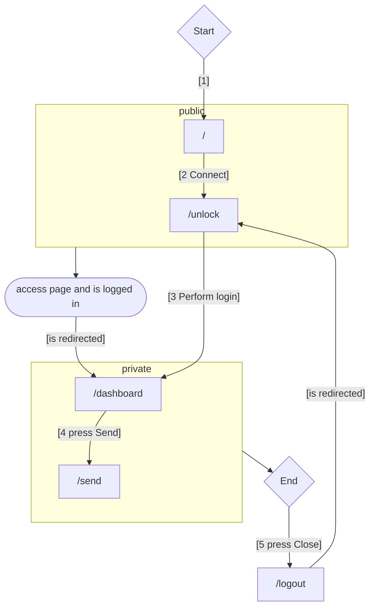
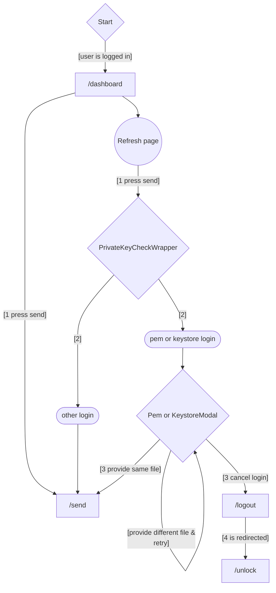
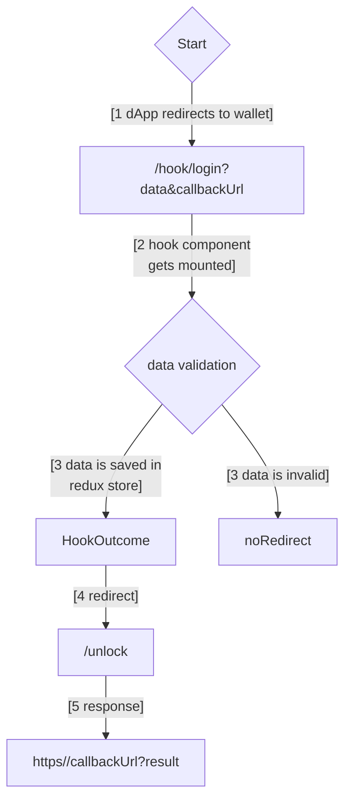

# MultiversX Lite Wallet DApp

[](https://github.com/your-repo)

🚧 **Notice: This project is not production-ready.** 🚧

> This repository is currently under development and not recommended for production use. Expect frequent changes and potential instability. Contributions and feedback are welcome, but please use this code at your own risk in a non-production environment.

The **MultiversX Lite Wallet DApp**, built using [React.js](https://reactjs.org/) and [Typescript](https://www.typescriptlang.org/).
It's a basic implementation of [@multiversx/sdk-dapp](https://www.npmjs.com/package/@multiversx/sdk-dapp), providing the basics for MultiversX authentication and transaction signing.

## Requirements

- Node.js version >=18
- Npm version >=10

## Getting Started

The dapp is a client side only project and is built using the [Create React App](https://create-react-app.dev) scripts.

### Installation and running

#### Step 1. Install modules

From a terminal, navigate to the project folder and run:

```bash
yarn  install
```

#### Step 2. Create the main config file

Go to `src/config` folder and edit the `config.sovereign.ts` file.
Create a new `index.ts` file with the contents of `config.sovereign.ts`.

#### Step 3. Running in development mode

In the project folder run:

```bash
yarn  start-sovereign
yarn  start-devnet
yarn  start-testnet
yarn  start-mainnet
```

This will start the React app in development mode, using the configs found in the `vite.config.ts` file.

Open [http://localhost:3000](http://localhost:3000) to view it in the browser.

The page will reload if you make edits.

You will also see any lint errors in the console.

#### Step 3. Build for testing and production use

A build of the app is necessary to deploy for testing purposes or production use.

To build the project run:

```bash
yarn  build-sovereign
yarn  build-devnet
yarn  build-testnet
yarn  build-mainnet
```

> **NOTE**
> If you want to set the account persistence to `sessionStorage`, you can do so in the `.env` file by configuring the `VITE_APP_PERSIST` variable. This will allow multiple address logins in different tabs but force providing both keystore and password on every sign transaction action from a connected dApp. In the default setting the wallet will only allow one address at a time to be logged in.

### Wallet Architecture

#### Basic user journey

The wallet is a dApp that allows the user to view his account balance and assets, send transactions, and sign transaction requests coming from another dApp.
To achieve these goals, it has public pages and private pages.

1. The user journey starts while not logged in, and accessing the home page (`/`).
2. The user clicks Connect and accesses the `/unlock` page
3. He chooses one of the login options and once done, gets redirected to the `/dashboard`, where he can check his balance and assets
4. From here, he can press the Send button to go to the `/send` page and make a transaction
5. By pressing Close, the journey ends and the user is redirected to `/unlock`



#### File login transaction signing

There is a difference in the user journey when the user chooses to login with a file-based provider (pem or keystore). Since the private key is stored in local memory, the user must provide the same file on every page refresh. If the user provides a different file, the login will not succeed. If the user will cancel the re-login pricess he will be logged out and redirected to the `/unlock` page.



#### Hook flow

The web-wallet allows the user to connect a dApp and sign transactions. The dApp can make several requests to the wallet, called hooks:

- login
- logout
- signTransaction

These requests can be in two ways:

1. The dApp makes a URL redirect to the wallet in the same tab. In this case the web-wallet will redirect back to the dApp after the action is completed.
2. The dApp opens the web wallet in a new tab as a child tab. In this case the web-wallet will send a post message to the parent tab with the result of the action.

The same principles apply to all hooks:

- The dApp sends a request to the wallet
- The wallet validates the request
- If the request is invalid, nothing happens
- If the request is valid, the wallet leads the user to the appropriate page
- The user performs the action
- The wallet sends the result back to the dApp

Below is an example of the login hook flow:



With the PostMessageListener, the HookOutcomeComponent is skipped and the user is redirected to appropriate page.

### Installation and running

## Roadmap

See the [open issues](https://github.com/multiversx/mx-template-dapp/issues) for a list of proposed features (and known issues).

## Contributing

Contributions are what makes the open source community such an amazing place to learn, inspire, and create. Any contributions you make are **greatly appreciated**.

One can contribute by creating _pull requests_, or by opening _issues_ for discovered bugs or desired features.

1. Fork the Project
2. Create your Feature Branch (`git checkout -b feature/AmazingFeature`)
3. Commit your Changes (`git commit -m 'Add some AmazingFeature'`)
4. Push to the Branch (`git push origin feature/AmazingFeature`)
5. Open a Pull Request


